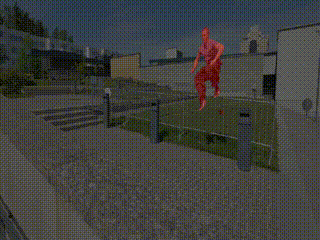

# Trainig Script for TTVOS

This code implementation of TinyML 2021 symposium paper :  [ightweight Video Object Segmentation with Adaptive Template Attention Module and Temporal Consistency Loss ](https://arxiv.org/abs/2011.04445).

We improve accuracy more by using better attention clue. The paper about new method will be uploaded soon.


 
 

 
## Dependencies:
```bash
python (>= 3.6)
numpy
pytorch (>= 1.6)
torchvision
pillow
tqdm
imgaug
opencv
```

## Datasets utilized:
DAVIS : download [here](https://davischallenge.org/davis2017/code.html)

```
/path/DAVIS
|-- Annotations/
|-- ImageSets/
|-- JPEGImages/
```

YouTubeVOS : download [here](https://competitions.codalab.org/competitions/20127#participate-get-data)

```
/path/ytvos2018
|-- train/
|-- train_all_frames/
|-- valid/
`-- valid_all_frames/
```

Saliency dataset : download [here](https://drive.google.com/file/d/1DOg-OATFD33ZnopOhz2IqIPpzABc187I/view?usp=sharing)

```
/path/Saliency
|-- ECSSD/
|-- HKU-IS/
|-- MSRA10K/
```

## Release

### DAVIS 

| model    |Backbone  | J & F 16| J & F 17| FPS   |link |
|----------|:--------:|:-------:|:-------:|:-----:| :-----:|     
| TTVOS-HR | HRNet    | 81.1    | 62.1    | 78.3  |[Google Drive](https://drive.google.com/file/d/1CedlOkynY9ja4Sd9q7wLO6-fELh_cM1R/view?usp=sharing)| 


## Run
### Train

1. Downlaod pre-trained HRNet in [here](https://1drv.ms/u/s!Aus8VCZ_C_33gSEsg-2sxTmZL2AT?e=AqHbjh) and re-name to 
'hrnet_w18_small_model_v1.pth'
2. Put the weights at the path ['./nnWeight'] 
3. Run train.py

### test
1. put the best file path [save_dir] and name [pth] in config setting

## Acknowledgement
This codebase borrows the code and structure from [official A-GAME repository](https://github.com/joakimjohnander/agame-vos).
We are grateful to Facebook Inc. with valuable discussions.


## Reference
The codebase is built based on following works
```Bibtex
@article{park2020ttvos,
  title={TTVOS: Lightweight Video Object Segmentation with Adaptive Template Attention Module and Temporal Consistency Loss},
  author={Park, Hyojin and Venkatesh, Ganesh and Kwak, Nojun},
  journal={arXiv preprint arXiv:2011.04445},
  year={2020}
}
}

```
